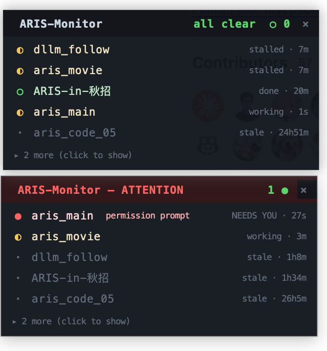

# ARIS-Monitor

<p align="center">
  
</p>

<p align="center"><em>Top: all-clear. Bottom: a session hit a permission prompt → the row goes red <strong>NEEDS YOU</strong> and the header turns red.</em></p>

A tiny, native, **always-on-top floating** macOS widget that shows, at a glance,
which of your running **Claude Code** sessions need you — primarily
**"needs approval / pending permission"**, plus a simple working / done status.

No browser. No Chrome extension. No Electron. Pure Python **stdlib Tkinter** —
**zero `pip install`**.

> ## 🔒 READ-ONLY monitoring + ONE opt-in focus action
> ARIS-Monitor builds its display by **only reading files** under `~/.claude` —
> monitoring is strictly read-only (liveness is inferred from file freshness; it
> does **not** even call `os.kill(pid, 0)`). The **one** non-read action is
> **Focus**: clicking a session row raises that session's terminal window. That
> path — and only that path — runs `ps` (to read the pid's tty) and the
> raise-only `focus-tty.sh` (osascript `activate` / `select`). Focus is always
> user-initiated and **never** kills, signals, writes, or modifies any session or
> process — it can only bring a window to the front. **No network calls, ever.**

## Run

```bash
./run.sh            # start the floating widget (top-right, draggable)
# or directly:
python3 widget.py
```

A small borderless panel appears top-right, floating above your windows. Drag
it by the dark header. Quit with the `×`, or press `q` / `Esc`.

**Click any session row** to jump to (focus) its terminal tab/window — the
triage loop is: panel goes red → click the row → you're at that terminal to
approve. Focus is raise-only (Terminal.app / iTerm2 / tmux); it never touches the
session itself.

Other modes:

```bash
./run.sh --check    # read-only smoke test (prints the classified list, no GUI)
./run.sh --ticker   # headless terminal ticker (same scanner, same 2s loop)
python3 scanner.py  # same as --check
```

## What it watches (READ-ONLY)

The authoritative needs-approval signal is the **live session registry**, not a
transcript guess:

```
~/.claude/sessions/<pid>.json     ->  status == "waiting"   (the core signal)
~/.claude/projects/<slug>/<id>.jsonl  (read-only tail, only to refine working/done)
```

The Claude Code app itself sets `status == "waiting"` (with an optional
`waitingFor` string like `Bash(npm test) needs approval`) **while a permission
prompt is on screen**, and clears it the instant you answer. So:

- needs-approval is detected with **no transcript parsing** — straight from the
  live JSON, which is why it is authoritative; and
- it is inherently **transient** — the widget **polls every ~2 s** to catch it.
  On a quiescent machine you will only ever see *working* / *done*, never
  *waiting*. That is expected, not a bug.

| dot | bucket          | meaning                                                              |
|-----|-----------------|---------------------------------------------------------------------|
| 🔴 ● | **NEEDS YOU**   | `status == "waiting"` — a permission prompt is blocking this session on you |
| 🟡 ◐ | working         | actively running (`busy` & fresh, or a background task in flight)    |
| 🟡 ◐ | stalled         | stopped mid-tool while **not** waiting — may need a nudge (**not** red) |
| 🟢 ○ | done            | last turn completed (`end_turn`) — finished, awaiting your review    |
| ·   | stale (dim)     | `updatedAt` older than 30 min — rendered dim and sorted to the bottom |

Sort order: NEEDS YOU → stalled → done → working → stale.

The panel shows the **top 5** rows by that order; everything beyond folds behind
a clickable `▸ N more (click to show)`. **needs-approval rows are never folded** —
the cut stretches to include every red session. (Tune the cap with `MAX_VISIBLE`.)

### Why not the "unmatched trailing tool call" heuristic?

Because a transcript that stops at a `tool_use` block while the session is
**not** `status=="waiting"` only means the run **stalled**, not that it is
waiting on your approval. Keying needs-approval off that would false-positive on
every mid-tool pause. The live `status=="waiting"` flag is the only
authoritative pending-permission signal, so that is what the red bucket uses.

### Codex is out of scope (for needs-approval)

Codex has **no** on-disk live-status file equivalent to `~/.claude/sessions`,
and its approval prompts are **not** written to the rollout JSONL. So ARIS-Monitor
does **not** scan Codex at all and will **never** claim Codex needs approval. The
pending-permission feature is **Claude-Code-only** by design.

## Empty / all-clear state

With zero active sessions the panel **stays visible** and shows a calm
`ARIS-Monitor — all clear  ○ 0` header (green, never red) with a dim
`no active Claude sessions` line. Zero sessions = "nothing needs you", which is
visually distinct from "needs approval".

## Files

- `widget.py`  — the Tkinter floating panel (UI; imports `scanner.scan()` for the
  read-only display and `focus.focus()` for the click-to-raise action).
- `scanner.py` — the strictly read-only classifier. Public: `scan()`,
  `summary()`. `python3 scanner.py` is a GUI-less smoke test.
- `focus.py`   — the ONE non-read action: raise a session's terminal (`ps` for
  the tty + `focus-tty.sh`). Strictly raise-only; never kills/writes/signals.
- `focus-tty.sh` — bundled raise-only shim (Terminal.app / iTerm2 / tmux pane).
  Always the bundled script (no `~/.claude/focus-tty.sh` override is executed),
  so the focus action's command surface stays provably bounded to this reviewed
  shim — osascript `activate`/`select` + read-only `tmux list-*` discovery, never
  `kill`/`send-keys`/session mutation.
- `ticker.py`  — headless terminal fallback (same scanner, same 2 s loop), used
  automatically when Tkinter is unavailable.
- `run.sh`     — launcher: verifies Tk, starts the widget, falls back to the
  ticker. Supports `--check` and `--ticker`.

## Dependencies

Python 3 standard library only: `tkinter`, `json`, `os`, `time`, `glob`,
`dataclasses`. **No pip. No venv. No brew (common case). No browser.**

Tkinter ships with macOS's Xcode Command Line Tools `/usr/bin/python3` and with
most conda / Homebrew pythons (Tk 8.6 verified present here). If
`python3 -c "import tkinter"` fails on a minimal interpreter, install Tk for it
(e.g. `brew install python-tk`) — or just use `./run.sh --ticker`, which needs
no Tk.

> **Note on `run.sh` and venvs:** ARIS-Monitor has *no* third-party
> dependencies, so there is nothing to install and `run.sh` deliberately does
> **not** create a venv — a fresh venv often lacks the compiled `_tkinter`
> module the base interpreter has, which would break the GUI. The launcher
> simply verifies Tk against your existing `python3` and runs.

## Tunables

Top-of-file constants in `scanner.py` / `widget.py`:

- `REFRESH_MS` (widget) / `REFRESH_S` (ticker) — poll cadence (default 2 s).
- `MAX_VISIBLE` (widget) — rows shown before the rest fold behind `▸ N more` (default 5; needs-approval rows are never folded).
- `LIVE_WINDOW` — seconds before a session is styled dim/stale and sorted to the bottom (1800 = 30 min).
- `IDLE_THRESHOLD` — busy-but-fresh cutoff for "working" (300).
- `TRANSCRIPT_TAIL_BYTES` — read-only tail size (256 KiB).

## macOS caveats (the documented price of zero-install)

`overrideredirect` floating windows are absent from Mission Control, are not
Cmd-Tab-able, and can sit *below* a true-fullscreen app's Space; the look is
utilitarian (no native rounded corners / vibrancy). Acceptable for an MVP
triage glance. The same `scanner.py` can later back a PyObjC `NSPanel` for 10/10
floating polish with zero detection-code changes — at the cost of one
`pip install pyobjc-framework-Cocoa`.
