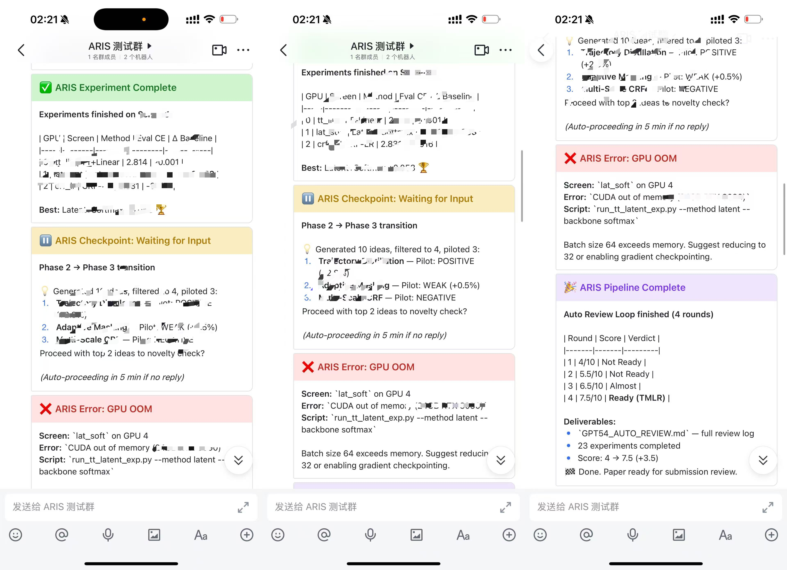
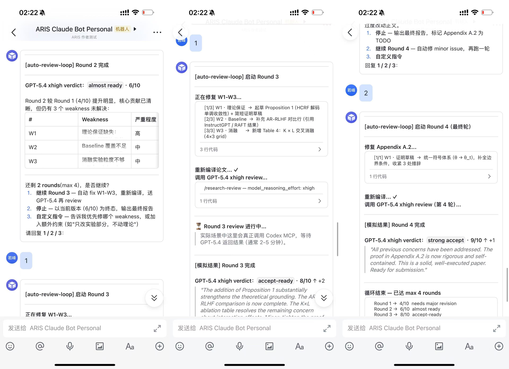

# Feishu / Lark Integration (Optional)

> 🇨🇳 中文版：[FEISHU_CN.md](FEISHU_CN.md)
> Mobile notifications + interactive approvals from your phone. Built around webhooks (push) and the [feishu-claude-code](https://github.com/joewongjc/feishu-claude-code) bridge (interactive).

Get mobile notifications when experiments finish, reviews score, or checkpoints need your input — without sitting in front of the terminal.

| Push Only (group cards) | Interactive (private chat) |
|:-:|:-:|
|  |  |

## Three modes — choose per-project

| Mode | What happens | You need |
|------|-------------|----------|
| **Off** (default) | Nothing. Pure CLI, no Feishu | Nothing |
| **Push only** | Webhook notifications at key events. Mobile push, no reply | Feishu bot webhook URL |
| **Interactive** | Full bidirectional. Approve/reject ideas, reply to checkpoints from Feishu | [feishu-claude-code](https://github.com/joewongjc/feishu-claude-code) running |

Without `~/.claude/feishu.json`, all skills behave exactly as before — zero overhead, zero side effects.

---

## Push-Only Setup (5 min)

Group notifications with rich cards — experiment done, review scored, pipeline complete. Mobile push, no reply needed.

### Step 1: Create a Feishu group bot

1. Open your Feishu group (or create a test group)
2. Group Settings → Bots → Add Bot → **Custom Bot**
3. Name it (e.g., `ARIS Notifications`), copy the **Webhook URL**
4. Security: add custom keyword `ARIS` (all notifications include this word), or leave unrestricted

### Step 2: Create config file

```bash
cat > ~/.claude/feishu.json << 'EOF'
{
  "mode": "push",
  "webhook_url": "https://open.feishu.cn/open-apis/bot/v2/hook/YOUR_WEBHOOK_ID"
}
EOF
```

### Step 3: Test it

```bash
curl -s -X POST "YOUR_WEBHOOK_URL" \
  -H "Content-Type: application/json" \
  -d '{
    "msg_type": "interactive",
    "card": {
      "header": {"title": {"tag": "plain_text", "content": "🧪 ARIS Test"}, "template": "blue"},
      "elements": [{"tag": "markdown", "content": "Push mode working! 🎉"}]
    }
  }'
```

You should see a blue card in your group. Skills will now automatically send rich cards at key events:

| Event | Card color | Content |
|-------|-----------|---------|
| Review scored ≥ 6 | 🟢 Green | Score, verdict, top weaknesses |
| Review scored < 6 | 🟠 Orange | Score, verdict, action items |
| Experiment complete | 🟢 Green | Results table, delta vs baseline |
| Checkpoint waiting | 🟡 Yellow | Question, options, context |
| Error | 🔴 Red | Error message, suggested fix |
| Pipeline done | 🟣 Purple | Score progression, deliverables |

---

## Interactive Setup (15 min)

Everything Push mode does, **plus** bidirectional private chat with Claude Code via Feishu. Approve/reject ideas, reply to checkpoints, give custom instructions — all from your phone.

**How it works**: Push cards go to the **group** (everyone sees status). Interactive conversations happen in **private chat** with the bot (you reply, Claude Code acts on it).

### Step 1: Complete Push setup above first (you'll keep both)

### Step 2: Create a Feishu app on [open.feishu.cn](https://open.feishu.cn/app)

1. Click **Create Enterprise App** → name it (e.g., `ARIS Claude Bot`) → create
2. Left menu → **Add Capabilities** → check **Bot**
3. Left menu → **Permissions** → search and enable these 5 permissions:

| Permission | Scope | Why |
|-----------|-------|-----|
| `im:message` | Send & receive messages | Core messaging |
| `im:message:send_as_bot` | Send as bot | Bot replies |
| `im:message.group_at_msg:readonly` | Receive group @mentions | Group messages |
| `im:message.p2p_msg:readonly` | **Receive private messages** | ⚠️ **Easy to miss!** Without this, the bot connects but never receives your messages |
| `im:resource` | Access attachments | Images/files |

4. Left menu → **Events & Callbacks** → select **Long Connection** mode → add event: `im.message.receive_v1` → save

> ⚠️ **Important**: The "Long Connection" page may show "未检测到应用连接信息" — this is normal. You need to start the bridge first (Step 3), then come back and save.

5. Left menu → **Version Management** → **Create Version** → fill description → **Submit for Review**

> For personal/test Feishu organizations, approval is usually instant.

### Step 3: Deploy the bridge

```bash
git clone https://github.com/joewongjc/feishu-claude-code.git
cd feishu-claude-code
python3 -m venv .venv && source .venv/bin/activate
pip install -r requirements.txt

# Configure
cp .env.example .env
```

Edit `.env`:

```bash
FEISHU_APP_ID=cli_your_app_id          # From app credentials page
FEISHU_APP_SECRET=your_app_secret      # From app credentials page
DEFAULT_MODEL=claude-opus-4-6          # ⚠️ Default is sonnet — change to opus for best results
DEFAULT_CWD=/path/to/your/project      # Working directory for Claude Code
PERMISSION_MODE=bypassPermissions      # Or "default" for safer mode
```

> ⚠️ **Model matters**: The default `claude-sonnet-4-6` works but may struggle with complex project context. `claude-opus-4-6` correctly identified 18 ARIS skills on first try where sonnet could not.

Start the bridge:

```bash
python main.py
# Expected output:
# ✅ 连接飞书 WebSocket 长连接（自动重连）...
# [Lark] connected to wss://msg-frontier.feishu.cn/ws/v2?...
```

For long-running use, put it in a screen session:

```bash
screen -dmS feishu-bridge bash -c 'cd /path/to/feishu-claude-code && source .venv/bin/activate && python main.py'
```

### Step 4: Save event config

Go back to Feishu Open Platform → Events & Callbacks → the long connection should now show "已检测到连接" → **Save**.

> If you published the app version before the bridge was running, you may need to create a new version (e.g., 1.0.1) and re-publish after saving event config.

### Step 5: Test private chat

1. In Feishu, find the bot in your contacts (search by app name)
2. Send it a message: `你好`
3. It should reply via Claude Code

**If the bot doesn't reply**: Send `/new` to reset the session, then try again. Common issues:

| Symptom | Cause | Fix |
|---------|-------|-----|
| Bot connects but never receives messages | Missing `im:message.p2p_msg:readonly` permission | Add permission → create new version → publish |
| Bot replies but doesn't know your project | `DEFAULT_CWD` points to wrong directory | Edit `.env` → restart bridge |
| Bot replies but seems less capable | Using `claude-sonnet-4-6` | Change to `claude-opus-4-6` in `.env` → restart |
| Old session has stale context | Session cached from before config change | Send `/new` in chat to start fresh session |
| "未检测到应用连接信息" when saving events | Bridge not running yet | Start bridge first, then save event config |

### Step 6: Update ARIS config

```bash
cat > ~/.claude/feishu.json << 'EOF'
{
  "mode": "interactive",
  "webhook_url": "https://open.feishu.cn/open-apis/bot/v2/hook/YOUR_WEBHOOK_ID",
  "interactive": {
    "bridge_url": "http://localhost:5000",
    "timeout_seconds": 300
  }
}
EOF
```

Now skills will:
- **Push** rich cards to the group (status notifications, everyone sees)
- **Private chat** you for decisions (checkpoints, approve/reject, custom instructions)

---

## Which skills send notifications?

| Skill | Events | Push | Interactive |
|-------|--------|------|-------------|
| `/auto-review-loop` | Review scored (each round), loop complete | Score + verdict | + wait for continue/stop |
| `/auto-paper-improvement-loop` | Review scored, all rounds done | Score progression | Score progression |
| `/run-experiment` | Experiments deployed | GPU assignment + ETA | GPU assignment + ETA |
| `/vast-gpu` | Instance rented/destroyed | Instance ID + cost | Instance ID + cost |
| `/monitor-experiment` | Results collected | Results table | Results table |
| `/idea-discovery` | Phase transitions, final report | Summary at each phase | + approve/reject at checkpoints |
| `/research-pipeline` | Stage transitions, pipeline done | Stage summary | + approve/reject |

## Alternative IM platforms

The push-only webhook pattern works with any service that accepts incoming webhooks (Slack, Discord, DingTalk, WeChat Work). Just change the `webhook_url` and card format in `feishu-notify/SKILL.md`. For bidirectional support, see:

- [cc-connect](https://github.com/chenhg5/cc-connect) — multi-platform bridge
- [clawdbot-feishu](https://github.com/m1heng/clawdbot-feishu) — Feishu Claude bot alternative
- [lark-openapi-mcp](https://github.com/larksuite/lark-openapi-mcp) — official Feishu MCP server

## Related skills

- [`/feishu-notify`](../../skills/feishu-notify/SKILL.md) — notification SKILL (pushes the cards)
- All long-running skills (review loops, experiments, pipelines) auto-emit cards when configured
